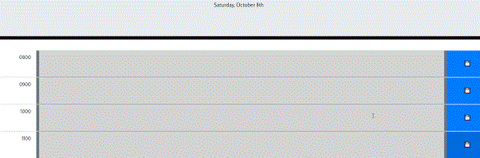

# Daily-Planner-Hourly
A text-based hourly planner for your day.

---
 

 

### By Michael Gostomski
 

## Usage
---
To use the planner, click in the center text field and type in the entry you would like to add to the planner. Use the blue button on the right side to save the item. The present hour block is colored red, future blocks green, and blocks that are in the past are gray.

 

## Installation
---
N/A

 

## Future Development
---
 - Add option for user to determine at which time the hourly blocks begin.
 - Add option for user to determine how many hour blocks are displayed.

  

## Languages and Tools Used
---
 - JavaScript
 - JQuery
 - HTML
 - CSS
 - Bootstrap
 - Moment.js
 - ShareX

## License
---

Please refer to the license in the Repo.

  
Link to the deployed application:  
https://mg8955.github.io/Daily-Planner-Hourly/
